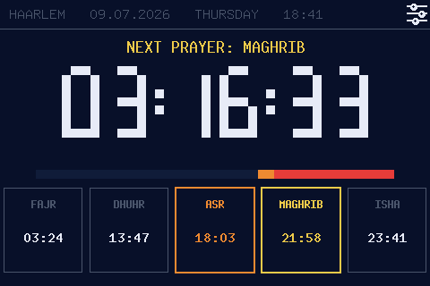
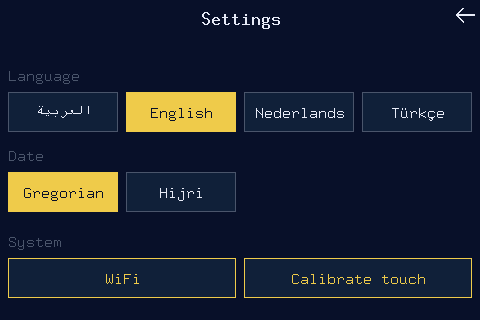

# Vaktu's-Salât — ESP32 Rust Prayer Times Dashboard

A `no_std`-free (std, ESP-IDF-based) Rust firmware for a 4.0" ESP32 TFT board
that connects to WiFi, syncs the clock over NTP, downloads the month's prayer
times for **Haarlem, Netherlands** from the [ezanvakti.emushaf.net](https://ezanvakti.emushaf.net/)
API, and shows a full-screen dashboard: the 5 daily vakits, the currently
upcoming one highlighted, and a live countdown until it. Tap the touchscreen
anywhere to toggle the header's date between Miladi (Gregorian) and Hijri.



Tapping the gear icon opens the settings screen — language, header date mode,
and the WiFi / touch-calibration system actions:



## Hardware

Board: **4.0 inch ESP32-32E Display** (also silkscreened as E32R40T /
E32N40T). Product page / vendor wiki with schematics and datasheets:
<https://www.lcdwiki.com/4.0inch_ESP32-32E_Display>

- **MCU**: ESP32 (Xtensa LX6, dual core @ 240MHz), the classic/original
  ESP32, not S2/S3/C-series. Revision v3.1, 4MB flash, **no PSRAM**.
- **Display controller**: ST7796S, driven over SPI (SPI2/HSPI bus),
  320×480 px physically (portrait), RGB565 color, BGR subpixel order.
  This firmware rotates it 90° in software to a 480×320 landscape canvas.
- **Touch controller**: XPT2046 (resistive), shares the same SPI2 bus as the
  display with its own CS line. Reads both pressure (for tap detection — e.g.
  toggling the header's date mode) and raw X/Y coordinates (fed through a
  per-unit affine calibration for touch-driven UI) — see
  [`src/touch.rs`](src/touch.rs) and
  [`src/touch_calibration.rs`](src/touch_calibration.rs).

None of this pinout is silkscreened or in the vendor wiki's text; it was
reverse-engineered from the sibling C project's `sdkconfig`
(`CONFIG_LV_DISP_*` / `CONFIG_LV_TOUCH_*` keys). Keep this table in sync if
you ever target a different board revision.

| Function                | GPIO | Notes |
| ------------------------ | ---- | ----- |
| Display MOSI             | 13   | shared SPI2 bus |
| Display SCLK             | 14   | shared SPI2 bus |
| Display CS               | 15   | |
| Display DC (data/cmd)    | 2    | |
| Display Backlight        | 27   | driven via LEDC PWM (`BACKLIGHT_DUTY_PERCENT` in `main.rs`), not a plain GPIO switch |
| Display Reset            | —    | not wired; tied high, unused in software (`mipidsi`'s `NoResetPin`) |
| Touch (XPT2046) MISO     | 12   | shared SPI2 bus |
| Touch (XPT2046) MOSI/CLK | 13/14| same lines as the display |
| Touch (XPT2046) CS       | 33   | |
| Touch (XPT2046) IRQ      | 36   | not wired up in software — this firmware polls pressure over SPI instead |
| Touch X calibration      | —    | vendor-default raw ADC range ~110–1971, X inverted (fallback only — see below) |
| Touch Y calibration      | —    | vendor-default raw ADC range ~88–1929, Y inverted (fallback only — see below) |

The X/Y ranges above are reverse-engineered vendor defaults, used **only** as
an emergency fallback (`vendor_default` in
[`logic/src/touch_calibration.rs`](logic/src/touch_calibration.rs)) when the
calibration wizard can't complete. Real coordinates come from a per-unit
5-point affine calibration run on first boot and stored in NVS — resistive
panels vary too much unit-to-unit to rely on fixed constants. See
[Touch calibration](#touch-calibration) below.

Tap detection still reads the Z1/Z2 pressure channels (no calibration
needed). The C driver uses pressure-based detection too
(`CONFIG_LV_TOUCH_DETECT_PRESSURE=y`, not the IRQ pin) — this firmware
follows that same proven approach rather than relying on GPIO36 alone,
since GPIO34-39 on the ESP32 have no internal pull resistors.

### Display quirks worth knowing

- **SPI clock: 80MHz, write-only.** Matches the C driver's own config
  (`CONFIG_LV_TFT_SPI_CLK_DIVIDER_1` = undivided 80MHz APB clock). The panel
  handles this fine; don't be surprised it's much faster than the usual
  "safe" 20-40MHz seen in generic SPI TFT tutorials.
- **Mirrored column order.** This specific panel's MADCTL column-address bit
  is the opposite of what the [`mipidsi`](https://docs.rs/mipidsi) crate
  assumes by default, for *any* rotation. It was root-caused by comparing
  against the C driver's known-good MADCTL bytes (`0x48` portrait /
  `0x28` landscape) — both encode the same fixed-up parity. The fix is
  setting `mirrored: true` on `mipidsi::options::Orientation` regardless of
  which `Rotation` you pick. If you ever change the rotation, keep
  `mirrored: true`.
- **BGR, not RGB** subpixel order (`ColorOrder::Bgr`).
- **Touch pressure threshold is untested on real hardware.** `PRESSURE_THRESHOLD`
  in [`src/touch.rs`](src/touch.rs) was picked from the same heuristic the
  popular PJRC/Adafruit `XPT2046_Touchscreen` Arduino driver uses
  (`z1 + (4095 - z2)`), not calibrated against this specific panel. If taps
  are missed or trigger spuriously, that constant is the first thing to tune.

## Touch calibration

Resistive panels vary too much unit-to-unit (and by how the glass is mounted)
to trust fixed ADC constants, so the raw XPT2046 readings are mapped to logical
(post-rotation, 480×320) screen coordinates through a per-unit **affine
transform** derived by an on-screen wizard:

```text
x_screen = a·x_raw + b·y_raw + c
y_screen = d·x_raw + e·y_raw + f
```

- **First-boot wizard**: runs right after display+touch init, *before* WiFi. It
  draws 5 crosshair targets — 4 corners inset ~12% from the edges (panels are
  least linear right at the border) plus the center — and captures a stable
  averaged tap at each (touch-down → sample → release, so a single long press
  can't skip a point).
- **Solve + verify**: the 4 corners over-determine the 6 coefficients (8
  equations, 6 unknowns), solved by least squares — more noise-robust than an
  exact 3-point solve. The center tap is *verification only*: if the solved
  transform predicts it more than ~15px off, the wizard restarts.
- **Persistence**: on success the 6 coefficients are stored as a JSON blob in
  the `touch`/`calib` NVS namespace (same pattern as the prayer-time cache) and
  reused on every later boot, so the wizard only runs once.
- **Re-calibration**: either **hold the screen for 5 seconds during the boot
  splash**, or tap **Settings → Calibrate touch** at any time. Both clear the
  saved calibration and re-run the wizard.
- **Fallbacks** (never hang): if a target gets no tap within 30s, or
  verification fails 3 full passes in a row, the firmware falls back to the
  documented vendor-default ADC constants (see the pinout table) with a warning
  and keeps running. The fallback is *not* persisted, so the next boot retries
  the wizard.

The affine solve is pure math with no hardware dependency, so it's unit tested
on a normal host toolchain in the `logic` crate (`solve_affine` in
[`logic/src/touch_calibration.rs`](logic/src/touch_calibration.rs)); the
device-facing wizard/NVS/gesture code is in
[`src/touch_calibration.rs`](src/touch_calibration.rs).

## External services

### Prayer times: ezanvakti.emushaf.net

Turkish Diyanet prayer times API, HTTPS, no API key needed. Endpoints:

| Endpoint | Purpose |
| --- | --- |
| `GET /ulkeler` | list of countries |
| `GET /sehirler/{ulkeId}` | cities/regions in a country |
| `GET /ilceler/{sehirId}` | districts in a city/region |
| `GET /vakitler/{ilceId}` | ~32 days of prayer times for a district |

IDs resolved once for this project and hardcoded in [`src/prayer.rs`](src/prayer.rs)
(`ILCE_ID`): **Hollanda** (Netherlands) → `UlkeID=4` → **Sehir "HOLLANDA"**
(the API lumps all of NL under one pseudo-city) → `SehirID=721` →
**Haarlem** → `IlceID=13877`. To retarget another city, re-run the same
`/ulkeler` → `/sehirler` → `/ilceler` chain and swap `ILCE_ID`.

The firmware caches the fetched month to NVS flash (see "NVS caching of
prayer data" under [Software architecture](#software-architecture) below),
so `/vakitler/13877` is only actually fetched over HTTPS on the very first
boot, or whenever today's
date falls outside the cached ~32-day range (checked every second, throttled
to one attempt per 5 minutes) — in practice about once a month. Of each
day's JSON object, only these fields are used:

- `MiladiTarihKisa` — Gregorian date, `"DD.MM.YYYY"`, used to find "today"'s
  row and shown in the header by default
- `HicriTarihKisa` — Hijri date, `"D.M.YYYY"`, shown in the header instead
  when you tap the touchscreen
- `Imsak`, `Ogle`, `Ikindi`, `Aksam`, `Yatsi` — the 5 vakits, `"HH:MM"`
  (`Gunes`/sunrise is returned too but intentionally not shown — it isn't
  one of the 5 daily prayers)

### Time sync: NTP

`esp_idf_svc::sntp::EspSntp` with ESP-IDF's defaults: `0.pool.ntp.org` through
`3.pool.ntp.org`. The firmware waits up to 20s for a sync at boot before
continuing (it proceeds either way — see [Software architecture](#software-architecture) for
why a failed/slow sync isn't fatal).

**Local time is NOT computed via libc `tzset`/`localtime_r`** — it wasn't
certain those are exposed through every version of the ESP-IDF Rust bindings,
so [`src/time_utils.rs`](src/time_utils.rs) implements Europe/Amsterdam's
CET/CEST offset from scratch (pure calendar math, no dependencies), following
the actual EU DST rule: CEST (UTC+2) from the last Sunday of March 01:00 UTC
to the last Sunday of October 01:00 UTC, CET (UTC+1) otherwise. If you deploy
this outside the EU, that's the function to replace.

## Software architecture

```
src/
├── main.rs        WiFi/SNTP/display/touch/backlight bring-up, main loop, all drawing code
├── prayer.rs       HTTPS fetch + JSON model for the ezanvakti API
├── cache.rs        NVS load/save for the fetched prayer-time month
├── touch.rs        XPT2046 touch driver (pressure + raw X/Y coordinates)
├── touch_calibration.rs  NVS persistence + 5-point calibration wizard + gesture
├── wifi_credentials.rs   NVS load/save for the on-device WiFi credentials
├── wifi_setup.rs   Touch-driven WiFi provisioning: scan picker + on-screen keyboard
├── time_utils.rs   Calendar math + Europe/Amsterdam DST offset (no libc)
└── segdisplay.rs    Seven-segment-style big digit renderer (embedded-graphics
                      primitives), used for the countdown clock
```

The pure affine solve/apply math (`Calibration`, least-squares `solve_affine`,
`vendor_default`) lives in the host-testable `logic` crate
([`logic/src/touch_calibration.rs`](logic/src/touch_calibration.rs)); the
`src/` module above is the hardware-facing half (NVS + on-screen wizard).

- **Rendering**: the panel is only repainted where something actually
  changed, not full-screen every tick — an earlier full `clear()` +
  redraw every second took 100-200ms and was visibly flickering.
  - `draw_static_frame` (whole-panel clear): only on the very first frame and
    on day rollover — draws the header separator and all 5 vakit cards.
  - `update_card_highlight`: redraws just the 1-2 cards whose highlight
    state changed (fires a handful of times a day, whenever the upcoming
    vakit changes).
  - `draw_dynamic`: the header line (date/weekday/clock), the "next vakit"
    label, the big countdown and the progress bar. Runs once a **minute**
    (the dashboard only shows minute resolution) and clears only its own
    small bounding box before redrawing, instead of the whole screen.
- **Fonts & localization**: the UI renders in one of three languages — Türkçe,
  English or العربية (Arabic) — chosen from the settings screen and persisted
  to NVS (namespace `settings`, keys `lang`/`datemode` as single bytes; see
  [`src/settings.rs`](src/settings.rs)). The `Language` enum and every
  translation table live in the host-testable
  [`namaz-vakti-logic`](logic/src/language.rs) crate.
  - **Latin (Türkçe/English)**: embedded-graphics' `mono_font::iso_8859_9`
    (Latin-5) fonts, not the default `ascii` set — `ascii` only covers
    0x20-0x7E and can't render Turkish letters (İ, ı, Ş, ş, Ğ, ğ, Ö, ö, Ü, ü,
    Ç, ç) at all.
  - **Arabic**: embedded-graphics mono fonts have no Arabic glyphs and do no
    contextual joining or RTL layout, so Arabic goes through a two-step path:
    the fixed label set is shaped by a small pure-Rust shaper
    ([`logic/src/arabic.rs`](logic/src/arabic.rs) — contextual
    isolated/initial/medial/final forms + lam-alef ligature, then reversed to
    visual right-to-left order) and drawn with the `u8g2-fonts` renderer's
    `unifont_t_arabic` / `10x20_t_arabic` faces, which cover the Arabic
    Presentation Forms-B block. Numeric fields (clock, date) stay in the mono
    font so digits aren't reversed. See [`src/text.rs`](src/text.rs) for the
    script-switching draw helper.
- **Resilience**: if WiFi fails to connect at boot, the device retries the
  saved credentials a bounded number of times (showing a "reconnecting"
  status when there's cached data to fall back on) and then drops into the
  on-device WiFi setup flow — no more reboot-loop on stale credentials. If
  the prayer-time fetch fails, it retries
  a few times with a status screen, then keeps retrying in the background
  (throttled to once per 5 minutes) once the main dashboard is showing.
  A failed/slow NTP sync isn't treated as fatal — in practice the ESP-IDF
  SNTP callback finishes shortly after and updates the clock before it's
  actually needed (the HTTPS TLS handshake's certificate-date check already
  requires a correct clock, so by the time prayer data is fetched the time
  is verified good).
- **Touch input**: the display and touch controller share one SPI2 bus
  (`SpiDriver` wrapped in an `Rc`, since `esp-idf-hal`'s `SpiDeviceDriver`
  only needs to *borrow* the bus — each device gets its own hardware CS
  pin and clock speed: 80MHz write-only for the display, 2MHz full-duplex
  for the touch ADC). On the dashboard, touch is used solely to hit-test a
  gear icon in the top-right of the header (a ~32×32 tap square): tapping it
  opens the settings screen, where the language and header date mode
  (Miladi/Hijri) are selected and immediately persisted. Tapping anywhere
  else on the dashboard does nothing. A raw touch is mapped to a screen pixel
  with the calibrated affine transform (`Calibration::to_screen`) before
  hit-testing.
- **Touch calibration**: see [Touch calibration](#touch-calibration) for the
  first-boot wizard, the raw→screen affine mapping, and re-calibration.
- **NVS caching of prayer data**: the fetched month is JSON-serialized into
  the `namaz`/`days` NVS blob (see [`src/cache.rs`](src/cache.rs)) every time
  a fetch succeeds. At boot, the cache is tried *before* any network
  activity; if it holds data, the dashboard can render as soon as WiFi+NTP
  are ready without waiting on ezanvakti.emushaf.net at all. The blocking
  "indiriliyor..." fetch screen from a completely empty flash (very first
  boot, or a corrupt/erased NVS) is the only time a boot actually waits on
  the HTTPS call.

## Rust / ESP-IDF toolchain setup

This targets the **classic ESP32**, which is Xtensa (not RISC-V) and needs
Espressif's Rust fork instead of upstream `rustc`, plus a full ESP-IDF
checkout (this uses `esp-idf-hal`/`esp-idf-svc`, i.e. `std`, not the
bare-metal `esp-hal`/`no_std` stack).

One-time setup:

```sh
# Xtensa Rust toolchain + LLVM + GCC
cargo install espup --locked
espup install --targets esp32
. ~/export-esp.sh   # run in every new shell before building; sets PATH/LIBCLANG_PATH

# ESP-IDF's build system needs these (native/system packages, e.g. via
# apt or Homebrew — anything that puts them on PATH works)
#   cmake, ninja

# Linker shim required by esp-idf-hal/esp-idf-svc std builds
cargo install ldproxy --locked

# Flashing tool
cargo install espflash --locked
```

`ESP_IDF_TOOLS_INSTALL_DIR = "workspace"` in [`.cargo/config.toml`](.cargo/config.toml)
means the first `cargo build` clones and builds ESP-IDF itself (~1-2GB,
several minutes) into `.embuild/` inside this project directory — no global
install needed, but expect a slow first build.

### macOS-specific gotchas

- **`cmake`/`ninja` via Homebrew**: `brew install cmake ninja`.
- **If `cargo`/`rustc` aren't on `PATH` even after `. ~/export-esp.sh`**:
  Homebrew's `rustup` formula (`brew install rustup`) doesn't create the
  usual `~/.cargo/bin/cargo`/`rustc` proxy shims that `rustup-init` normally
  does, so plain `rustup`-managed toolchains can be invisible to your shell.
  Confirm with `rustup which cargo` (should resolve to the `esp` toolchain
  because of [`rust-toolchain.toml`](rust-toolchain.toml)); if that path
  works but bare `cargo` doesn't, add its directory to `PATH` for the
  session: `export PATH="$HOME/.rustup/toolchains/esp/bin:$PATH"`.
- **No CH340/CP210x driver install needed** on modern macOS (Ventura+) —
  Apple ships native DriverKit support for those chips
  (`AppleUSBCHCOM.dext`/`AppleUSBSLCOM.dext`). If the board doesn't show up
  as `/dev/cu.usbserial-*` after plugging in (see
  [Build & flash](#build--flash) below), suspect the USB cable (many bundled
  cables are charge-only) or port/hub before chasing a driver.

## Configuration (WiFi credentials)

WiFi credentials are set **on the device**: on first boot (or whenever the
saved credentials stop working), the panel drops into a touch-driven setup
flow — scan for a network, tap to pick it, and type the passphrase on an
on-screen keyboard. Credentials are stored in NVS flash (namespace `wifi`,
key `creds`) and reused on every later boot. You can re-run setup any time from
**Settings → WiFi** (e.g. after changing routers or passwords). No reflash is
needed to change networks.

### Optional: seeding credentials at build time (dev/CI)

For a headless bench/CI build — where there's no one to tap through setup — you
can still bake in credentials via [`toml-cfg`](https://github.com/jamesmunns/toml-cfg).
If present, `cfg.toml` only *seeds* NVS on the very first boot (when no
credentials are stored yet); the on-device value always wins afterwards.
`cfg.toml` is gitignored, so the password never ends up in the repo:

```sh
cp cfg.toml.example cfg.toml
# edit cfg.toml with your real SSID/password
```

```toml
# cfg.toml
[namaz-vakti]
wifi_ssid = "YOUR_WIFI_SSID"
wifi_psk = "YOUR_WIFI_PASSWORD"
```

## Build & flash

```sh
. ~/export-esp.sh
cargo build --release
espflash flash --port /dev/ttyUSB0 target/xtensa-esp32-espidf/release/namaz-vakti
espflash monitor --port /dev/ttyUSB0   # optional: view logs over serial
```

`--port` can be omitted — `espflash flash` will prompt you to pick from the
detected ports if there's ambiguity. To find it yourself:

- **macOS**: `ls /dev/cu.*` before and after plugging in; the new entry is
  usually `/dev/cu.usbserial-<n>`. If nothing new shows up, it's almost
  always the USB cable (charge-only) or port, not a missing driver — see
  the macOS gotchas above.
- **Linux**: `/dev/ttyUSB0` (or `ttyACM0`) as in the example above; `dmesg
  | tail` after plugging in confirms it.

`espflash monitor` opens an interactive session (`Ctrl+R` reset, `Ctrl+C`
exit) and needs a real terminal with a TTY attached — it'll fail with
"Failed to initialize input reader" if run from a script or a
non-interactive shell.

### Flashing from WSL2

If you're building on Windows under WSL2, the board enumerates as a Windows
COM port and isn't visible to Linux until you attach it with
[usbipd-win](https://github.com/dorssel/usbipd-win):

```powershell
# Windows PowerShell, as Administrator, one-time:
winget install usbipd

usbipd list                              # find the board's BUSID (look for "CH340"/"CP210x"/"USB Serial")
usbipd bind --busid <BUSID>               # one-time per device
usbipd attach --wsl --busid <BUSID>       # run again any time the board is unplugged/replugged
```

It should then show up in WSL as `/dev/ttyUSB0`.

## Possible future work

- A settings screen to pick a different city without recompiling (the
  touch-driven WiFi-setup keyboard and the recalibration menu entry now exist —
  see [Configuration](#configuration-wifi-credentials) and
  [Touch calibration](#touch-calibration)).
- Multiple saved WiFi networks / automatic network switching (today it's a
  single stored credential — "forget and re-enter" via **Settings → WiFi**).
- Actual backlight dimming control (a schedule, an ambient light sensor, or
  just a manually-set day/night level) — the PWM plumbing is already there,
  it's just fixed at `BACKLIGHT_DUTY_PERCENT`.
- Qibla direction (`KibleSaati` is already in the API response, unused).
- Cache eviction/rotation — the NVS blob is simply overwritten on every
  successful fetch, which is fine at this data size (a few KB) but worth
  knowing if you extend what's cached.
